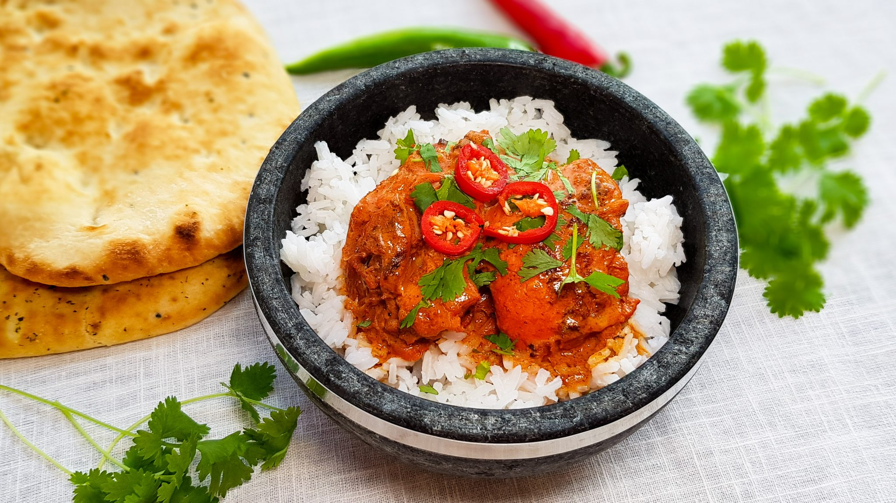

# markdown
voorbeeld les markdown skills

## Kip Tandoori

Voorbereiding 20 min
Bereiding 10 min
Totale bereidingstijd: 30 min
Porties: 4 personen

**Ingredienten**

Kip tandoori Marinade
- 800 gram kippendijen
- 100 ml yoghurt
- 1 tl paprikapoeder
- 1 tl chilipoeder
- 1 tl gemalen kardemom
- 1 tl kurkuma
- 1 el komijn
- 1 el gemalen koriander
- 1 tl rode voedselkeurstof optioneel
- 3 teentjes knoflook
- stukje gember
- zout
- peper

**Saus**
- 400 gram pandanrijst
- 150 ml yoghurt
- 150 ml kookroom
- paar druppels rode voedselkleurstof optioneel
- 50 ml kippenbouillon
- paar druppels citroensap
- verse koriander garnering
- 1 rode peper garnering

---

**Instructies**
1. Maak de knoflook en de gember schoon. Pers de knoflook en rasp de gember. Snijd de kippendijen in tweeën en meng ze met de knoflook en de gember en alle andere ingrediënten voor de marinade. Breng de marinade op smaak met peper en zout. Zet zolang mogelijk opzij totdat je het nodig hebt. Kook ondertussen de rijst gaar volgens de bereidingswijze op de verpakking.

2. Veeg de overtollige marinade van de kip en houd deze apart. Verhit een beetje zonnebloemolie in een grillpan en grill de kippendijen hierin totdat ze gaar zijn en mooie grillstrepen hebben. Doe de overgebleven marinade met 150 ml yoghurt, een paar druppels rode kleurstof, 150 ml kookroom, de kippendijen, 50 ml kippenbouillon en de aanbaksels uit de 

3. pan samen in een grote wokpan en verwarm goed. Voeg eventueel wat citroensap naar smaak toe. Laat pruttelen totdat de saus is ingedikt
Verdeel de rijst over 4 borden of kommen, schep hier de kip Tandoori op. Garneer met wat verse koriander en ringetjes rode peper
